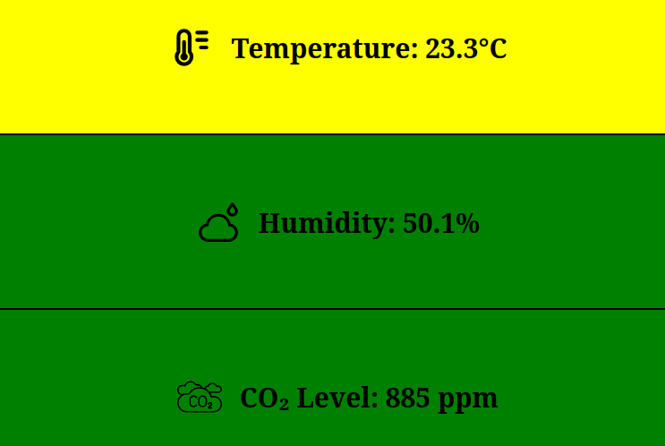

### Measuring Temperature and CO2 with Sensirion SCD30
<br/>

> This post descibes how to set up the Sensirion SCD30 with a Raspberry Pi Zero and serve its
measurements within your home network

<b>Things you will need for this setup:</b>
<br>
1. Sensirion SCD30 (eg. from [digikey](https://www.digikey.ch/en/products/detail/sensirion-ag/SCD30/8445334))
2. Raspberry Pi (any except Pico) (eg. Raspberry Pi Zero from [digikey](https://www.digikey.ch/en/products/detail/raspberry-pi/SC0065/18881027))
3. Header Pins for the SCD30 (eg. from [digkey](https://www.digikey.ch/en/products/detail/harwin-inc/D01-9922046/3727867))
4. Jumper Wires (eg. from [digikey](https://www.digikey.ch/en/products/detail/sparkfun-electronics/PRT-12796/5993861))

First, you will have to solder the header pins on the SCD30 board, such that you can connect it to your Raspberry.
Of course, you could also solder a wire directly to the sensor and connect it with the Raspberry. But assuming that
you want flexibility in what device you want to connect your sensor to, the approach via pins and jumper cable is probably
the easiest.

<br>
To connect the sensor to the Raspberry via the I2C interface, you will have to connect the SCL, SDA and VDD pins to
the Raspberry Pi's SCL, SDA and 3.3V pins.

<br>
<br>
<div style="text-align: center;">

</div>

<br>
<br>

The pin layout for the Raspberry Pi Zero can be found eg [here](https://www.pi4j.com/1.2/pins/model-zerow-rev1.html)

Once your sensor is connected to the power pin the XX should start blinking.

To check if the sensor is properly connected to the I2C interface, first enable I2C on your Raspberry via

```bash
sudo raspi-config
# 3: Interface options -> I5 I2C
```

Then install `i2c-tools` to check if the sensor is properly connected

```bash
sudo apt install i2c-tools
i2cdetect -y 1
```

This should show that you have device 0x61 connected.

Now you are ready to send commands to the sensor and read from it via the I2C Interface.
The available commands are listed in [Sensirion's Interface Description](https://sensirion.com/media/documents/D7CEEF4A/6165372F/Sensirion_CO2_Sensors_SCD30_Interface_Description.pdf)

<br>

On my github, you will find a preconfigured C library that includes most of the important interface functions
to start communicating with the sensor right away.

Simply include the `scd30` header file in your code and connect to the sensor.

<br>

```c
#include "scd30.h"

if (scd30_init() < 0) exit(1);
struct scd30_data data;

while (1) {
    while (!scd30_get_data_ready_status()) usleep(1000);
    scd30_read_measurement(&data);
    
    printf("C02 is: %f\n, data.co2);
    printf("Temp is: %f\n, data.temp);
    printf("Humidity is: %d\n, data.humidity);
    
    sleep(10);
}
```

If you would like to query your data from ...
Webserver...

<div style="text-align: center">

</div>
